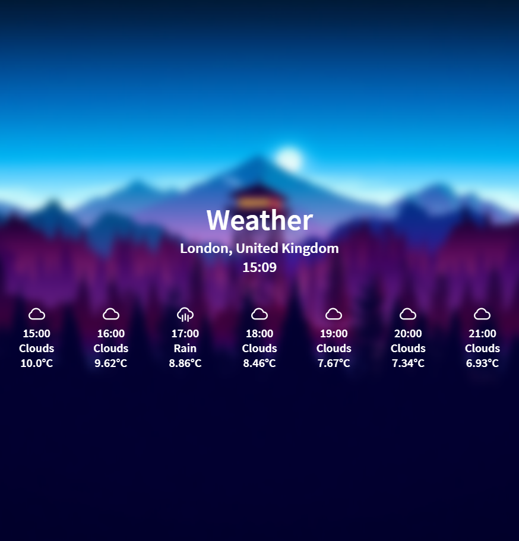

# simpleweather

## Information
A simple and beautiful weather app built using the Flask framework and the Open Weather Map API

## Setup
1. Clone this repo using `git clone https://github.com/mattmoody05/simpleweather.git`
2. Navigate to the root folder of the repo using the terminal
3. Install the Python dependencies using `pip3 install -r requirements.txt` (these instructions you alrady have Python installed correctly)
4. Navigate the the `src` folder within terminal 
5. Complete the `config.json` file, making sure that all fields are filled in
6. Run the flask application using `py -3 app.py` on Windows, or `python3 app.py` on macOS or Linux
7. In a web browser, navigate to `localhost:5000` and the weather app should be working, populated with the correct weather for your chosen location

## Data handling
I am aware that personal data is processed in this project. This is the reason that it is not deployed. If this project is every deployed, the userdata will be stored securely, following the correct GDPR guidelines. 

## Issues
If you encounter any issues with this project, please don't hesitate to open a issue on this repo and I will resolve it as fast as possible.